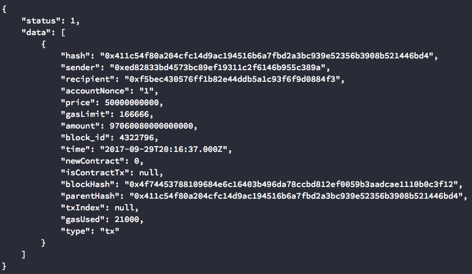
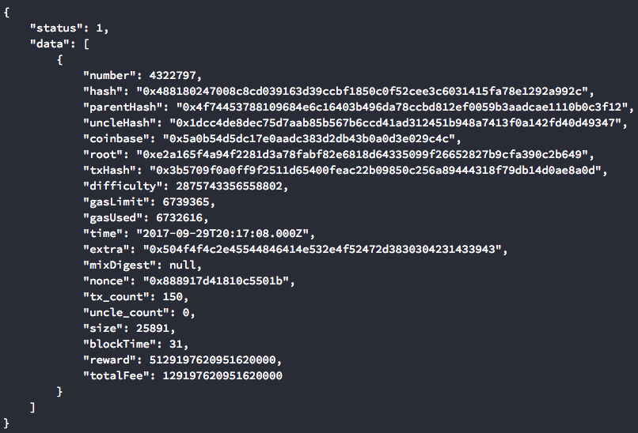
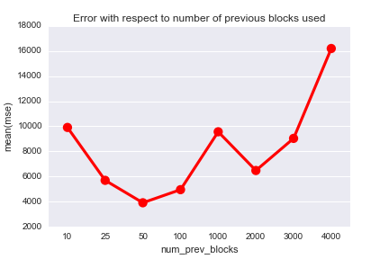
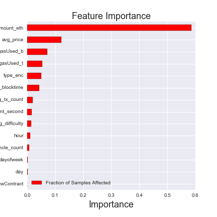

# Predicting Ethereum Gas Prices

## Motivation 

### Ethereum blockchain

Blockchain technology has been embraced in recent years as a common method of dealing with transactions. It has advantages that reach far beyond the tradition systems that have been used for decades. Some of the benefits include peer-to-peer networks for transactions, which eliminate the necessity of intermediates such as administrators or banks. Moreover, it is a decentralized platform which translates to faster transactions as well as reduction of the risk of fraud. Ethereum is a decentralized platform that incorporates smart contracts.

### What is gas?

Each ethereum transaction specifies a "gas limit" and "gas price". 
- Gas limit: the total amount of gas that is alloted for a given transaction. If the limit is reached, the transaction will stop. This prevents infinite loops.
- Gas price: the price per unit gas. Miners typically approve transactions with higher gas prices. 

The outcome of a transaction depends on gas:
- A successful transaction will complete, the miner will get a reward, and the remaining gas is returned to the sender.
- A transaction runs out of gas before it completes, so it fails. The consumed gas is not refunded to the sender. 

### Use case

We would like to predict the gas price for a given transaction to successfully complete. 
- Too high: the transaction will be stuck in the network longer and will take longer to complete. 
- Too low: the transaction will run out of gas and will fail to complete. 

## Data curation

The data was mined from the etherchain API (https://www.etherchain.org/).

### Transaction level

Certain information is contained in every transaction. A total of 1,494,279 transactions were collected. The transactions spanned over a time period of 7 days, between 9-19-2017 and 9-24-2017.   

### Block level 

Also information about the nature of a block. This can be thought of as the "environment" or state in which a transaction exists at a given moment of time. A total of 14,583 blocks were collected.

### Filtering

Only monetary transactions were considered, thus any transaction with an amount of 0 was dropped. Additionally, transactions with a gas price of 0 were filtered out of the data. This left us with a total of 631,783 transactions and 14,473 blocks.  

### Merged data

The transation data was merged with block data to obtain a final dataset containing feature variables at both the transaction level and block level.

### Feature engineering

We engineered new features based on information from previous blocks. Since the blockchain is public, we can consider at any moment the averaged values of information from previous blocks, giving us an idea of the current state of the network. Our model will factor in these averaged values to predict gas prices.  

To this aim, the question arises: how many blocks in the past must be considered such that the averaged values are predictive? 
- Windows of 5, 10, 25, 50, 100, 1000, 2000, 3000, and 4000 were considered (i.e., how many previous blocks will the average be calculated over)
- The mean-squared error (MSE) was charted for each window and plotted
- The minimized MSE was found to occur for a window of 50 blocks

## Modeling

## Random forest regressor

A random forest regressor was used to predict gas price. In evaluating the performance of the model, an R2 value of 0.2 was obtained. 

## Summary
